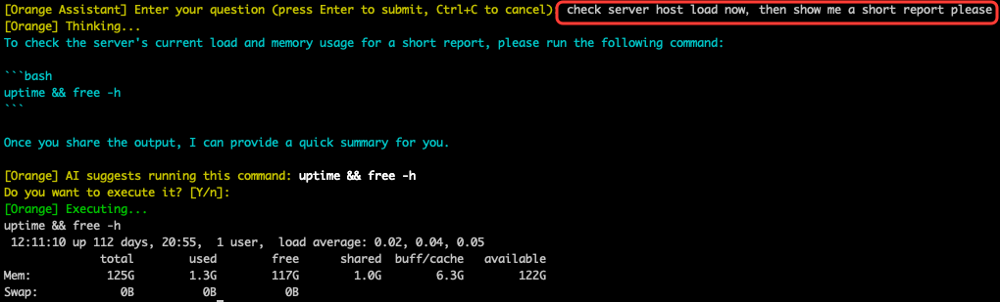

# Orange 🍊

**Orange** 是一款 AI 驱动的 SSH 代理助手，旨在无缝集成到您日常的终端工作流中。它是标准 `ssh` 命令的透明且开箱即用的替代品。

您可以像使用原生 SSH 一样使用 Orange。但是当您遇到晦涩的错误、复杂的部署任务或只是需要分析系统性能时，只需按下快捷键，智能的 AI 代理就会随时为您服务。



## ✨ 为什么选择 Orange？

- **零摩擦上下文**：不再需要复制粘贴终端日志到浏览器。Orange 会自动捕获您终端的最后 8KB 输出，并将其作为上下文直接发送给 AI。
- **完全兼容 SSH**：支持公钥认证（通过 `~/.ssh/id_rsa` 或 SSH Agent）、交互式密码认证、自定义端口和标准的 `user@host` 路由（甚至支持跳板机）。
- **安全且透明**：以安全为设计核心。它使用标准的 `~/.ssh/known_hosts` 验证来防范中间人攻击（MITM）。

## 🚀 核心功能

### 🗣️ 交互式助手
在活动的 SSH 会话中，随时按下 **`Ctrl+G`** 即可唤醒助手。与远程服务器的连接会暂停，允许您向 AI 提问（支持中文、英文等）。AI 会分析您最近的终端历史记录，并在控制台中直接为您提供响应。

### ⚡ 标准助手模式 (默认)
在默认模式下，Orange 充当智能的键盘代理。如果 AI 认为某条命令能解决您的问题，它会建议该命令并等待您的批准（`[Y/n]`）。如果批准，Orange 会为您在终端中输入并执行该命令。**注意：** 此模式下 Orange 不会跟踪命令何时结束，输出会显示在屏幕上。如果您想让 AI 分析执行结果，您必须在命令结束后再次按下 `Ctrl+G`。

### 🤖 全自动智能体循环 (`--autonomous`)
当使用 `--autonomous` 参数启动时，Orange 将变身为全自动的智能体。它不再是输入命令后就停止，而是形成了一个 **“推理-行动-观察”的闭环 (Reasoning-Acting-Observation Loop)**：
1. AI 决定运行什么命令来收集数据。
2. Orange 阻塞挂起，积极跟踪该命令的执行状态。
3. 命令完成后，Orange 自动将输出结果和退出码再次回传给 AI。
4. AI 对结果进行分析总结，并输出最终报告。

为实现这一目标，它采用了一套 **双轨执行 (Dual-Track Execution)** 系统：
- **后台静默执行**: 对于数据收集和分析类命令（如 `cat`, `grep`, `top`），智能体会在隐藏的后台 SSH 会话中瞬间执行。您的终端画面将始终保持整洁。
- **前台交互执行**: 对于改变环境（如 `cd`）或需要 UI 渲染（如 `vim`）的命令，智能体会直接在您的活动 PTY 中注入执行。

### 🛠️ Agent 技能系统 (Skills)
Orange 支持一个 `Skills` 目录，您可以在其中存放包含自定义故障排除工作流或公司特定 SOP 的 Markdown 文件（例如 Docker 调试、日志分析）。这些技能将加载到 AI 的系统提示中，严格指导其行为并标准化其建议的命令。

### 🔌 MCP (模型上下文协议) 集成
为您的 AI 赋能！Orange 原生支持使用标准化的 JSON-RPC 2.0 MCP 协议的外部工具。您可以配置 Orange 来生成外部二进制文件（如自定义的 Golang 工具、Python SQLite 读取器或 Node.js 脚本），解析它们的可用工具，并允许 AI 与您的本地环境进行无缝交互。

---

## 📖 开始使用

### 前置条件
- Go 1.21 或更高版本
- 兼容 OpenAI 格式的 API Key（OpenAI, DeepSeek, Anthropic, 或本地端点如 Ollama）

### 安装

1. 克隆仓库:
   ```bash
   git clone https://github.com/zxpbenson/orange.git
   cd orange
   ```

2. 编译项目:
   ```bash
   make build
   ```
   *(支持交叉编译: `make build-linux`, `make build-mac`, `make build-windows`)*

3. 设置默认配置:
   ```bash
   make setup-config
   ```
   这会生成 `~/.config/orange/config.json`。**编辑此文件** 添加您的 API 密钥。

### 使用方法

像使用 SSH 一样连接到服务器:
```bash
./build/orange -p 2022 root@127.0.0.1
./build/orange -i ~/.ssh/my_private_key user@host.com
```

连接后，触发 AI:
```text
[Orange] Connected. Press Ctrl+G to ask the AI assistant.
```

### 命令行参数
- `-p <port>`: 指定远程 SSH 端口 (默认: 22)
- `-i <identity_file>`: 私钥文件路径 (默认: `~/.ssh/id_rsa` 或 SSH Agent)
- `--approval-policy`: 设置为 `always` (运行 AI 命令前提示) 或 `never` (立即运行，有风险！)
- `--autonomous`: 开启全自动智能体循环 (Autonomous Agentic Loop)。AI 将自动执行命令、分析输出并做出决策，直到任务完成。

## 📁 文档
要深入了解 TTY 拦截器、LLM 模块和 SSH 客户端如何协同工作，请阅读[架构设计文档](doc/architecture.md)，其中包含了详细的 Mermaid 工作流图表。

## 📜 许可证
MIT License
