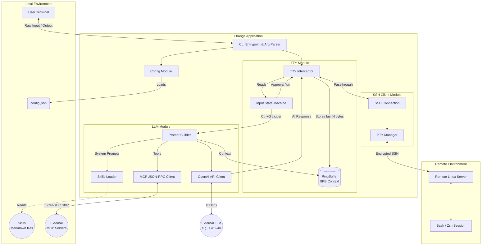
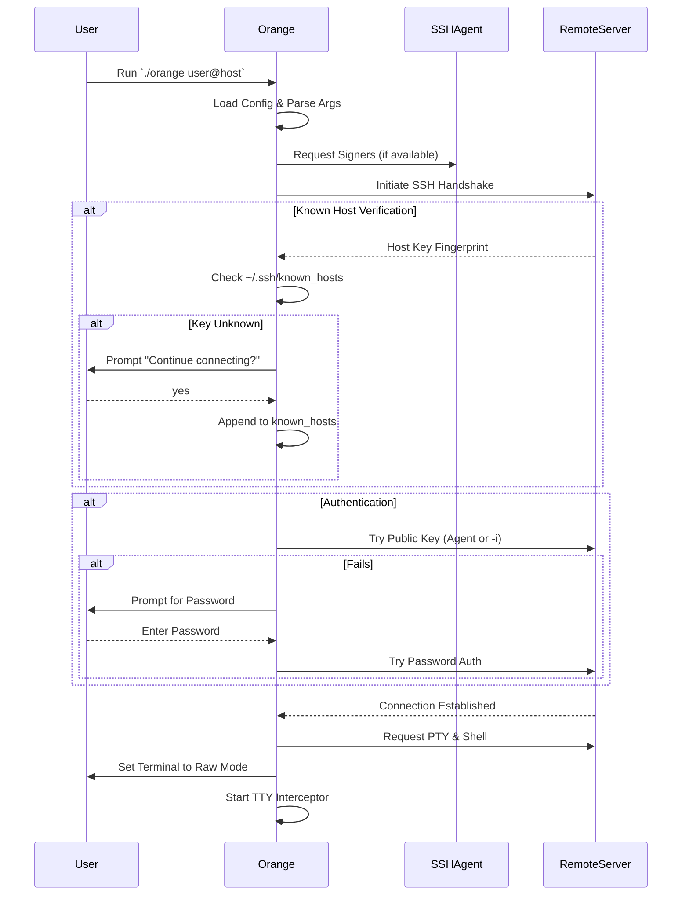
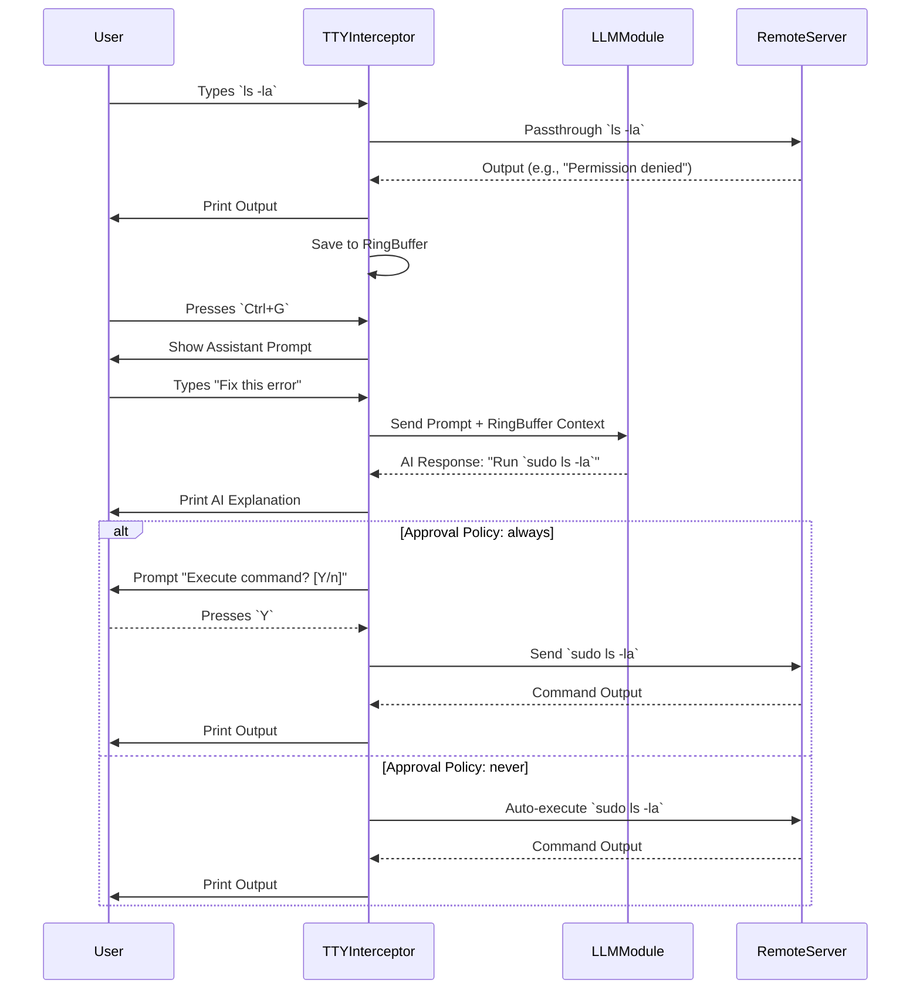

# Architecture Design

This document outlines the high-level architecture, core modules, and execution workflows of **Orange**, an AI-powered SSH Proxy Assistant.

## 1. System Overview

Orange sits transparently between the user's local terminal and the remote SSH server. It functions in two primary modes:

1.  **Passthrough Mode (Default):** Standard `stdin`, `stdout`, and `stderr` streams are piped directly to and from the remote SSH session. The application quietly maintains a rolling buffer (`RingBuffer`) of recent terminal outputs.
2.  **Assistant Mode:** Triggered by a specific hotkey (`Ctrl+G`). Orange temporarily intercepts `stdin`, pauses the passthrough, and captures user input for the AI. It then sends the user's prompt, along with the contextual history from the `RingBuffer` and loaded `Skills` (Markdown guides), to an external Large Language Model (LLM).

If the AI suggests a command to resolve an issue, Orange enters an **Approval Workflow** to allow the user to execute the command directly on the remote server safely.

## 2. High-Level Architecture

The following diagram illustrates the primary components and data flow within the Orange application.

## 3. Core Modules

### 3.1 Main & Config (`cmd/orange/main.go`, `internal/config/`)
-   **CLI Parsing**: Handles command-line flags (`-p`, `-i`, `--approval-policy`), custom `user@host` routing (including jump host syntax), and graceful connection teardown.
-   **Configuration**: Reads the local `~/.internal/config/orange/config.json` to configure the LLM endpoint, model choice, `skills_dir`, and external `mcp_servers`.

### 3.2 SSH Client (`internal/sshclient/`)
-   **Authentication**: Wraps `golang.org/x/crypto/ssh`. It supports public-key authentication via `SSH_AUTH_SOCK` (SSH Agent) or an explicit identity file (`-i`). If public-key auth fails, it falls back to **Interactive Password Authentication**.
-   **Security**: Manages `known_hosts` verification to protect against MITM attacks. If a host key is unknown, it prompts the user for confirmation before appending it to `~/.ssh/known_hosts`.
-   **PTY Management**: Requests a `xterm-256color` PTY that matches the user's local terminal size.

### 3.3 TTY Interceptor (`internal/tty/`)
-   **Stream Bridging**: The heart of the application. It spawns goroutines to continuously read from the remote `stdout`/`stderr` and write to the local terminal while copying a chunk of the stream to the `RingBuffer`.
-   **Input Handling**: It intercepts local `stdin` rune-by-rune (handling multi-byte UTF-8 encoded characters properly, e.g., Chinese input) to detect the `Ctrl+G` sequence and toggle between Passthrough and Assistant modes.

### 3.4 LLM & MCP Integration (`internal/llm/`)
-   **Prompt Engineering**: Formats requests using the standard OpenAI chat completions schema. It dynamically injects instructions from local Markdown files (`Skills`) to constrain the AI's behavior and formatting rules.
-   **MCP Client**: For advanced tool usage, it spawns child processes defined in `mcp_servers`, connects via `stdio`, and negotiates available tools using the Model Context Protocol (JSON-RPC 2.0). These tools are converted into LLM functions and appended to the prompt.

## 4. Execution Workflows

### 4.1 Connection & Authentication Flow

### 4.2 Assistant & Command Approval Flow

