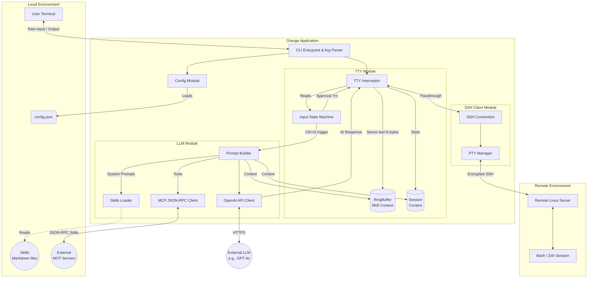
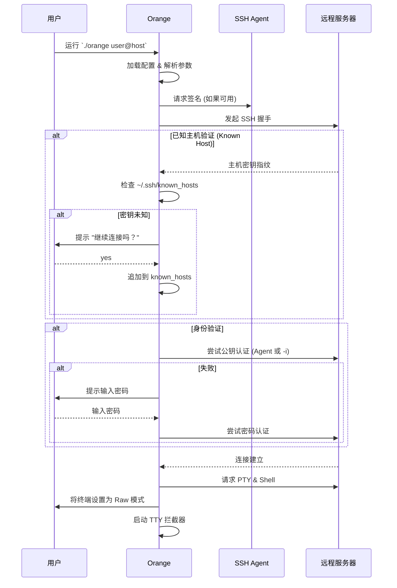
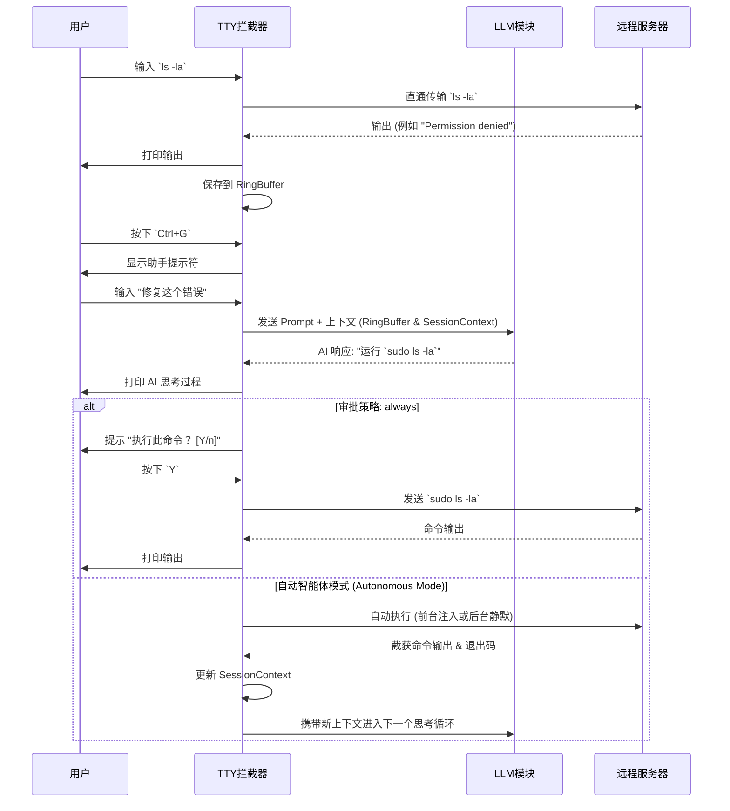

# 架构设计

本文档概述了 **Orange**（一款 AI 驱动的 SSH 代理助手）的高层架构、核心模块以及执行工作流。

## 1. 系统概述

Orange 透明地位于用户的本地终端和远程 SSH 服务器之间。它主要在三种模式下运行：

1.  **直通模式 (Passthrough Mode) (默认):** 标准的 `stdin`、`stdout` 和 `stderr` 流直接在本地与远程 SSH 会话之间建立管道。应用程序会在后台静默维护一个最近终端输出的滚动缓冲区 (`RingBuffer`)。
2.  **助手模式 (Assistant Mode):** 通过特定快捷键 (`Ctrl+G`) 触发。Orange 临时拦截 `stdin`，暂停直通，并捕获用户的提问。随后它将用户的提示，连同来自 `RingBuffer` 的上下文历史和已加载的技能 (`Skills` Markdown 指南)，一起发送给外部的大语言模型 (LLM)。
3.  **全自动智能体模式 (Autonomous Agent Mode) (`--autonomous`):** LLM 会以严格的 JSON 格式回复，阐述其 *Thought* (思考)、*Action* (行动) 和 *Command* (命令)。智能体会自动在一个后台 SSH 会话中静默运行命令，以收集更多上下文，而不会污染用户的终端。它将输出结果迭代地反馈给 LLM，直到完成最终任务目标。

如果 AI 建议通过某条命令来解决问题，Orange 会进入 **审批工作流 (Approval Workflow)**，允许用户安全地确认并直接在远程服务器上执行该命令。

## 2. 高层架构

下图展示了 Orange 应用程序内部的主要组件和数据流。

## 3. 核心模块

### 3.1 Main 与配置 (`cmd/orange/main.go`, `internal/config/`)
-   **CLI 解析**: 处理命令行参数 (`-p`, `-i`, `--approval-policy`, `--autonomous`)，支持自定义的 `user@host` 路由（包括跳板机语法），以及优雅的连接关闭。
-   **配置管理**: 读取本地 `~/.config/orange/config.json`，用于配置 LLM 端点、模型选择、`skills_dir` 以及外部的 `mcp_servers`。

### 3.2 SSH 客户端 (`internal/sshclient/`)
-   **身份验证**: 封装了 `golang.org/x/crypto/ssh`。支持通过 `SSH_AUTH_SOCK` (SSH Agent) 或显式身份文件 (`-i`) 进行公钥认证。如果公钥认证失败，它会回退到 **交互式密码认证**。
-   **安全性**: 管理 `known_hosts` 验证，防范中间人 (MITM) 攻击。如果主机密钥未知，它会在将其追加到 `~/.ssh/known_hosts` 之前提示用户确认。
-   **PTY 管理**: 请求与用户本地终端大小相匹配的 `xterm-256color` PTY。
-   **后台执行**: 支持在不依赖 PTY 的情况下开启独立 Session，用于全自动模式下静默后台命令的执行。

### 3.3 TTY 拦截器 (`internal/tty/`)
-   **数据流桥接**: 应用程序的核心。它生成 goroutine 持续从远程 `stdout`/`stderr` 读取数据并写入本地终端，同时将部分数据流复制到 `RingBuffer`。
-   **输入处理**: 它逐个字符拦截本地 `stdin`（正确处理多字节 UTF-8 编码字符，如中文输入），以检测 `Ctrl+G` 序列并在直通模式和助手模式之间切换。
-   **状态机**: 解析 ANSI 转义序列 (OSC 命令)，防止快捷键冲突（如 `0x07` BEL）破坏终端原生功能（例如 Vim 的颜色查询）。
-   **会话上下文追踪**: 为 AI 维护 `SessionContext`，捕获注入到远程会话中命令的 `$PWD`、最后输出 (Last Output) 和退出状态码 (Exit Code)。

### 3.4 LLM 与 MCP 集成 (`internal/llm/`)
-   **提示词工程**: 使用标准的 OpenAI Chat Completions 结构格式化请求。它动态注入本地 Markdown 文件 (`Skills`) 中的指令，以约束 AI 的行为和格式规则。
-   **MCP 客户端**: 为支持高级工具能力，它会拉起在 `mcp_servers` 中定义的子进程，通过 `stdio` 建立连接，并使用模型上下文协议 (Model Context Protocol, JSON-RPC 2.0) 协商可用工具。这些工具将被转换为 LLM 函数并追加到系统提示词中。

## 4. 执行工作流

### 4.1 连接与认证流程

### 4.2 助手与命令审批/自动流程

